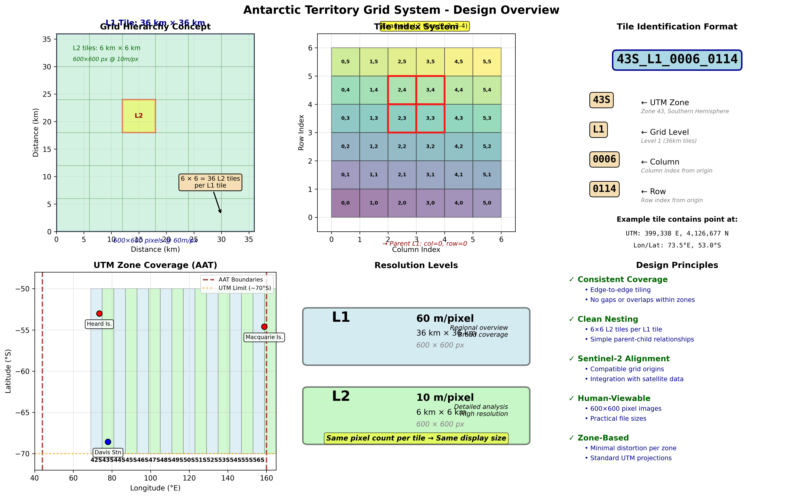

# Antarctic Territory Grid System

A hierarchical geospatial tiling system for the Australian Antarctic Territory (AAT), designed for multi-resolution imagery processing and analysis.



## Overview

This system provides a standardized grid framework covering terrestrial regions of the AAT (44°E to 160°E, extending from ~50°S to ~70°S), including:
- Antarctic mainland (AAT sector)
- Heard Island and McDonald Islands
- Macquarie Island
- Associated reefs, ice shelves, and coastal sea ice

## Key Features

- **Two-level hierarchy**: Coarse (36km) and fine (6km) grids with perfect 6×6 nesting
- **Sentinel-2 aligned**: Compatible with existing satellite imagery workflows
- **Simple tile IDs**: Format `{zone}_{level}_{col}_{row}` (e.g., `43S_L1_0006_0114`)
- **UTM-based**: Standard projections with minimal distortion
- **Human-viewable**: All tiles render as 600×600 pixel images
- **Multi-zone support**: Covers 17 UTM zones (42S-58S)

## Quick Start

```r
# Load the grid system
source("R/antarctic_grid_system.R")

# Initialize zones
zones <- define_utm_zones()

# Create a tile ID from coordinates
tile_id <- make_tile_id("43S", "L1", 6, 114)
# Result: "43S_L1_0006_0114"

# Get all child tiles of an L1 tile
children <- get_child_tiles(l1_col = 6, l1_row = 114)
# Result: 36 L2 tiles (6×6 grid)
```

## Grid Specifications

| Parameter | Level 1 (L1) | Level 2 (L2) |
|-----------|-------------|--------------|
| Tile Size | 36 km × 36 km | 6 km × 6 km |
| Resolution | 60 m/pixel | 10 m/pixel |
| Image Size | 600 × 600 px | 600 × 600 px |
| Coverage | ~1,300 km² | ~36 km² |

**Nesting**: Each L1 tile contains exactly 6 × 6 = 36 L2 tiles

## Installation

### Requirements

**Minimal (core functionality):**
- R >= 4.0

**Full functionality (spatial operations):**
```r
install.packages(c("sf", "dplyr"))
```

**System dependencies (Ubuntu/Debian):**
```bash
sudo apt-get install libgdal-dev libudunits2-dev libproj-dev
```

### Clone Repository

```bash
git clone https://github.com/YOUR-USERNAME/aat-grid-system.git
cd aat-grid-system
```

## Usage

### Generate Tiles for a Region

```r
source("R/antarctic_grid_system.R")
source("R/generate_tile_grids.R")

# Initialize
zones <- define_utm_zones()

# Define region (Heard Island)
heard_bbox <- c(xmin = 72.5, ymin = -53.5, xmax = 74.0, ymax = -52.5)

# Generate tiles
tiles_l1 <- generate_tiles_for_bbox(heard_bbox, "L1", zones)
tiles_l2 <- generate_tiles_for_bbox(heard_bbox, "L2", zones)

# Export
st_write(tiles_l1, "heard_island_L1.gpkg")
```

### Navigate Tile Hierarchy

```r
# Get parent of an L2 tile
parent <- get_parent_tile(l2_col = 38, l2_row = 687)

# Get all children of an L1 tile
children <- get_child_tiles(l1_col = 6, l1_row = 114)
```

### Convert Coordinates to Tiles

```r
# UTM coordinates to tile index
idx <- utm_to_tile_index(x = 399338, y = 4126677, level = "L1")

# Create tile ID
tile_id <- make_tile_id("43S", "L1", idx$col, idx$row)
```

## Examples

Run the demonstration scripts:

```bash
# Basic demo (no dependencies)
Rscript examples/demo_standalone.R

# Full demo (requires sf package)
Rscript examples/demo_grid_system.R

# Generate visualizations
python3 examples/visualize_grid.py
```

## Repository Structure

```
aat-grid-system/
├── R/
│   ├── antarctic_grid_system.R    # Core grid definitions
│   └── generate_tile_grids.R      # Tile generation functions
├── examples/
│   ├── demo_standalone.R          # Basic demonstration
│   ├── demo_grid_system.R         # Full demo with sf
│   └── visualize_grid.py          # Create diagrams
├── docs/
│   ├── QUICK_REFERENCE.md         # Quick reference guide
│   └── PROJECT_SUMMARY.md         # Detailed project summary
├── figures/
│   ├── grid_system_overview.png   # System overview diagram
│   └── grid_nesting_detail.png    # Nesting detail diagram
├── README.md                       # This file
├── .gitignore
└── LICENSE
```

## Documentation

- **[README.md](README.md)** - This overview
- **[Quick Reference](docs/QUICK_REFERENCE.md)** - Common operations and examples
- **[Project Summary](docs/PROJECT_SUMMARY.md)** - Comprehensive project details

## Design Rationale

### Why These Tile Sizes?

- **36 km tiles**: Provide regional coverage (~1,300 km² per tile)
- **6 km tiles**: Enable detailed analysis (~36 km² per tile)
- **6:1 ratio**: Creates clean nesting with simple mathematics
- **600×600 pixels**: Human-viewable size with manageable file sizes

### Why Sentinel-2 Alignment?

1. **Established standard** in remote sensing
2. **Existing tool support** across the ecosystem
3. **Easy data integration** with satellite imagery
4. **Future-proof** approach

## Performance

- **Tile indexing**: Instantaneous (simple arithmetic)
- **Small regions** (<100 tiles): <1 second
- **Heard Island region**: ~10 L1 tiles, ~360 L2 tiles
- **Full AAT coverage**: Thousands of tiles (one-time generation)

## Next Steps

- [ ] Generate complete AAT tile catalog
- [ ] Integrate land/ice masks for filtering
- [ ] Develop imagery rendering pipeline
- [ ] Create spatial database index
- [ ] Implement web tile service (WMS/WMTS)
- [ ] Add STAC metadata support

## Contributing

Contributions are welcome! Please feel free to submit issues or pull requests.

## License

[Choose appropriate license - e.g., MIT, Apache 2.0, GPL-3.0]

## Contact

For questions or collaboration opportunities:
- **Issues**: [GitHub Issues](https://github.com/YOUR-USERNAME/aat-grid-system/issues)

---

**Version**: 1.0 | **Status**: Production Ready | **Date**: November 2025
